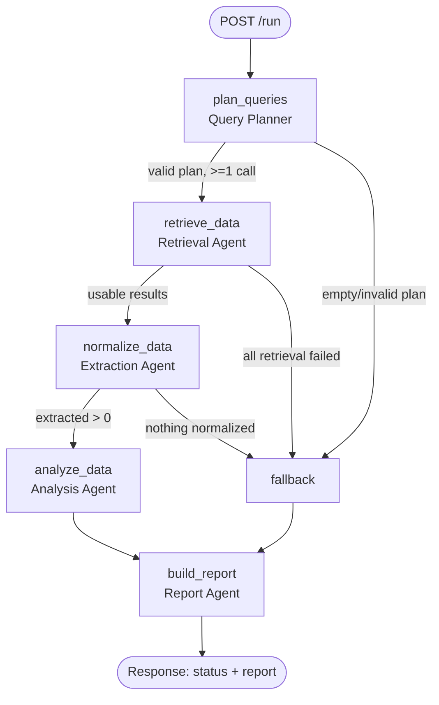

# Engineering Plan — Agentic Search Intelligence System (LangGraph DAG)

> **Purpose of this document:** a complete, unambiguous, senior-level build plan for the
> "AI Agent Engineer — Technical Assessment (v2.0)". Every requirement in the spec is mapped to a
> concrete task, file, and acceptance check. Read `WHAT_TO_BUILD.md` first for the plain-English scope.
>
> **Success bar:** any senior engineer or AI reviewer scores this **10/10** across all evaluation areas.
> Nothing in the spec is skipped; every graded criterion has an explicit, verifiable deliverable.

---

## 0. Requirement → Deliverable Traceability Matrix

This is the master checklist. Nothing ships until every row is ✅. (Status filled during build.)

| #   | Spec requirement (section)                                                                      | Where it's satisfied                | Status |
| --- | ----------------------------------------------------------------------------------------------- | ----------------------------------- | ------ |
| R1  | Explicit DAG via LangGraph, named nodes/edges (§3.1)                                            | `app/graph/build.py`                | ✅     |
| R2  | Conditional routing + fallback path (§3.1)                                                      | `app/graph/edges.py`                | ✅     |
| R3  | DAG diagram in README (§3.1)                                                                    | `README.md` (Mermaid)               | ✅     |
| R4  | 5 atomic single-responsibility agents (§3.2)                                                    | `app/agents/*.py`                   | ✅     |
| R5  | No agent does two jobs (§3.2)                                                                   | Typed contracts + per-agent tests   | ✅     |
| R6  | Tools defined with Pydantic/JSON schemas (§3.3)                                                 | `app/tools/schemas.py`              | ✅     |
| R7  | LLM decides tool + args; validate args before real call (§3.3)                                  | `app/tools/base.py`                 | ✅     |
| R8  | Graceful handling of malformed/partial tool args (§3.3)                                         | `app/tools/base.py`                 | ✅     |
| R9  | DataForSEO integration w/ documented mode flag (§3.4)                                           | `app/integrations/dataforseo/`      | ✅     |
| R10 | One tool per logical API call (§3.4)                                                            | `app/tools/dataforseo_tools.py`     | ✅     |
| R11 | Retry w/ exponential backoff + jitter (§3.5)                                                    | `app/resilience/retry.py`           | ✅     |
| R12 | Retryable vs non-retryable classification (§3.5)                                                | `app/resilience/errors.py`          | ✅     |
| R13 | Sane timeouts on all external calls (§3.5)                                                      | HTTP client config                  | ✅     |
| R14 | Graceful degradation / partial results + error flag (§3.5)                                      | fallback node + state               | ✅     |
| R15 | Circuit breaker (bonus) (§3.5)                                                                  | `app/resilience/circuit_breaker.py` | ✅     |
| R16 | Structured JSON logs per node (inputs redacted, outputs, duration, success, retries) (§3.6)     | `app/observability/logging.py`      | ✅     |
| R17 | Trace across run (correlation ID) (§3.6)                                                        | `app/observability/tracing.py`      | ✅     |
| R18 | Metrics: latency, success/fail rate, API call counts (§3.6)                                     | `app/observability/metrics.py`      | ✅     |
| R19 | README: production observability roadmap (§3.6)                                                 | `README.md`                         | ✅     |
| R20 | `POST /api/v1/profiles` → 201 shape (§4.1)                                                      | `app/api/routes/profiles.py`        | ✅     |
| R21 | `GET /api/v1/profiles/{uuid}` + summary stats (§4.1)                                            | `app/api/routes/profiles.py`        | ✅     |
| R22 | `POST /api/v1/profiles/{uuid}/run` full DAG + response fields (§4.2)                            | `app/api/routes/runs.py`            | ✅     |
| R23 | `GET /api/v1/profiles/{uuid}/queries` filters+pagination+fields (§4.2)                          | `app/api/routes/queries.py`         | ✅     |
| R24 | `GET /api/v1/profiles/{uuid}/recommendations` + fields (§4.2)                                   | `app/api/routes/recommendations.py` | ✅     |
| R25 | `POST /api/v1/queries/{uuid}/recheck` partial re-run (§4.2)                                     | `app/api/routes/queries.py`         | ✅     |
| R26 | Persistence: profiles/runs/queries/recommendations (§5)                                         | `app/db/models.py`                  | ✅     |
| R27 | README (architecture, setup, agents, failures+example, observability+excerpt, limitations) (§5) | `README.md`                         | ✅     |
| R28 | Tests: happy path, simulated failure+retry/fallback, tool-arg validation (§5)                   | `tests/` (spec-named files)         | ✅     |
| R29 | `.env.example` documenting config (§5)                                                          | `.env.example`                      | ✅     |
| R30 | Single-command run + clear git history (§7)                                                     | `Makefile`, commits                 | ✅     |
| R31 | opportunity_score formula documented (§4.2)                                                     | `app/agents/analysis.py` + README   | ✅     |
| R32 | total tokens used surfaced (§4.2)                                                               | token callback in LLM client        | ✅     |

> **Rule:** If you cannot point at a file/test that proves a row, it is not done.

---

## 1. Architecture Overview

### 1.1 High-level shape

```
                         ┌─────────────────────────────────────────┐
   HTTP (JSON)           │            FastAPI application           │
  ───────────────▶       │  routes → services → LangGraph runner    │
                         └───────────────┬─────────────────────────┘
                                         │ invokes
                                         ▼
                         ┌─────────────────────────────────────────┐
                         │        LangGraph DAG (compiled)          │
                         │  Planner → Retrieval → Extract →         │
                         │  Analyze → Report  (+ fallback edges)    │
                         └───────────────┬─────────────────────────┘
             tools (validated)           │              observability
                     ▼                   ▼                    ▼
        ┌────────────────────┐  ┌────────────────┐  ┌──────────────────┐
        │ DataForSEO client  │  │  Persistence   │  │ logs/trace/metrics│
        │ (live | mock |stub)│  │ (SQLite/SQLA)  │  │ (JSON, corr-id)   │
        └────────────────────┘  └────────────────┘  └──────────────────┘
```

### 1.2 Layered responsibilities

- **API layer (FastAPI):** request/response validation, status codes, pagination, error mapping.
- **Service layer:** orchestrates a DAG run, persists results, computes summary stats. Keeps routes thin.
- **Graph layer (LangGraph):** the DAG — nodes, edges, conditional routing, shared typed state.
- **Agent layer:** the 5 atomic agents; each is a pure-ish function `(state) -> state_delta`.
- **Tool layer:** Pydantic-typed tools bound to the LLM; validate args; wrap DataForSEO calls.
- **Integration layer:** DataForSEO HTTP client with timeouts, retries, circuit breaker, mock mode.
- **Resilience layer:** retry/backoff/jitter, error classification, circuit breaker.
- **Observability layer:** JSON structured logging, correlation-ID tracing, metrics collector.
- **Persistence layer:** SQLAlchemy models + repositories for profiles/runs/queries/recommendations.

### 1.3 Tech stack (chosen, with rationale)

| Concern            | Choice                                                  | Why                                                                         |
| ------------------ | ------------------------------------------------------- | --------------------------------------------------------------------------- |
| Language           | **Python 3.11+**                                        | Spec mandates Python; 3.11 for speed + typing.                              |
| Orchestration      | **LangGraph** + LangChain                               | Spec explicitly names it; native DAG + conditional edges + state.           |
| LLM                | **OpenAI** (via `langchain-openai`), provider-swappable | Native tool-calling + token usage; abstracted behind interface.             |
| API                | **FastAPI** + Uvicorn                                   | Async, Pydantic-native, auto OpenAPI docs, correct status codes.            |
| Validation/Schemas | **Pydantic v2**                                         | Tool schemas + request/response models + arg validation.                    |
| Persistence        | **SQLAlchemy 2.0** + **SQLite**                         | Zero-config local DB; sound relational model; easily swappable to Postgres. |
| HTTP client        | **httpx**                                               | Timeouts, connection pooling, sync+async.                                   |
| Retries            | Custom `retry` (or **tenacity**)                        | Explicit backoff+jitter, error classification (spec wants _real_ logic).    |
| Logging            | **structlog** (or std `logging` + `python-json-logger`) | JSON logs, bound context (correlation id).                                  |
| Tracing            | Custom correlation-ID trace + **optional LangSmith**    | Follows a request node-by-node without hard external dep.                   |
| Testing            | **pytest** + `pytest-asyncio` + `respx`/monkeypatch     | Happy path, failure injection, arg validation.                              |
| Tooling            | **ruff** (lint), **black** (format), **mypy** (types)   | Code-quality grading area.                                                  |
| Runner             | **Makefile** + `python -m app`                          | Single-command run (§7).                                                    |

> **Decision — DataForSEO mode:** Default to **mock mode** (deterministic fixtures behind
> `DATAFORSEO_MODE=mock`) so the system is runnable with zero credentials and tests are hermetic, with a
> **`live` mode** fully wired (Basic-auth httpx client) for a real sandbox key. This is stated loudly in
> the README (§3.4 compliance). Mock responses are realistic samples of real DataForSEO payloads.

---

## 2. Project Structure

```
ai-agent-assessment-muhammad-moiz/
├── app/
│   ├── __main__.py                 # `python -m app` entrypoint (starts API)
│   ├── config.py                   # Pydantic Settings (env-driven: keys, timeouts, retries, mode)
│   ├── api/
│   │   ├── app.py                  # FastAPI app factory, middleware, exception handlers
│   │   ├── deps.py                 # DB session, service deps
│   │   ├── errors.py               # error→HTTP mapping, uniform error envelope
│   │   └── routes/
│   │       ├── profiles.py         # POST /profiles, GET /profiles/{uuid}
│   │       ├── runs.py             # POST /profiles/{uuid}/run
│   │       ├── queries.py          # GET /profiles/{uuid}/queries, POST /queries/{uuid}/recheck
│   │       └── recommendations.py  # GET /profiles/{uuid}/recommendations
│   ├── schemas/                    # Pydantic request/response models (API contracts)
│   │   ├── profile.py
│   │   ├── run.py
│   │   ├── query.py
│   │   └── recommendation.py
│   ├── services/
│   │   ├── profile_service.py      # profile CRUD + summary stats
│   │   ├── pipeline_service.py     # runs the DAG, persists results, builds run response
│   │   └── recheck_service.py      # single-query partial re-run
│   ├── graph/
│   │   ├── state.py                # PipelineState (TypedDict/Pydantic) — the shared DAG state
│   │   ├── build.py                # build + compile the LangGraph StateGraph
│   │   ├── nodes.py                # node wrappers (bind agents to graph, add tracing/metrics)
│   │   └── edges.py                # conditional routing + fallback edge functions
│   ├── agents/                     # 5 ATOMIC agents — one job each
│   │   ├── planner.py              # Query Planner
│   │   ├── retrieval.py            # Search/Retrieval Agent(s) (tool-calling)
│   │   ├── extraction.py           # Extraction/Normalization Agent
│   │   ├── analysis.py             # Analysis/Synthesis Agent (+ opportunity_score formula)
│   │   └── report.py               # Report Agent (JSON + human summary)
│   ├── tools/
│   │   ├── schemas.py              # Pydantic input schemas for each tool (types/desc/required)
│   │   ├── base.py                 # ValidatedTool wrapper: validate args → call → wrap errors
│   │   └── dataforseo_tools.py     # one tool per DataForSEO logical endpoint
│   ├── integrations/
│   │   └── dataforseo/
│   │       ├── client.py           # httpx client, auth, timeouts, retry+breaker, mode switch
│   │       ├── endpoints.py        # endpoint definitions (paths, method, response mapping)
│   │       └── mock/               # deterministic mock fixtures (realistic DataForSEO payloads)
│   ├── llm/
│   │   ├── client.py               # LLM factory, tool binding, token-usage callback
│   │   └── prompts.py              # per-agent system prompts (versioned)
│   ├── resilience/
│   │   ├── errors.py               # error taxonomy: Retryable vs NonRetryable
│   │   ├── retry.py                # exponential backoff + jitter executor
│   │   └── circuit_breaker.py      # per-dependency breaker (closed/open/half-open)
│   ├── observability/
│   │   ├── logging.py              # structlog JSON config + redaction
│   │   ├── tracing.py              # correlation-id context, span timing
│   │   └── metrics.py              # in-memory metrics collector + end-of-run summary
│   └── db/
│       ├── database.py             # engine/session, init_db
│       ├── models.py               # Profile, Run, Query, Recommendation ORM models
│       └── repositories.py         # data-access functions (no business logic in routes)
├── tests/
│   ├── conftest.py                 # fixtures: app client, in-mem DB, mock LLM, mock DataForSEO
│   ├── test_happy_path.py          # full run → completed, correct shapes
│   ├── test_failure_retry.py       # inject transient failure → retry succeeds
│   ├── test_fallback_degradation.py# exhaust retries → partial/fallback, no crash
│   ├── test_tool_validation.py     # malformed/missing args rejected gracefully
│   ├── test_api_contracts.py       # status codes + response shapes + pagination/filters
│   └── test_opportunity_score.py   # formula correctness + bounds [0,1]
├── README.md                       # architecture, diagram, setup, agents, failures, observability
├── PLAN.md                         # (this file)
├── WHAT_TO_BUILD.md                # plain-English scope
├── .env.example                    # documented config
├── Makefile                        # make install | run | test | lint | seed
├── pyproject.toml                  # deps, ruff/black/mypy config
└── requirements.txt                # (or poetry/uv lock) pinned deps
```

---

## 3. Data Model & Persistence (R26)

### 3.1 Entities & relationships

```
Profile 1───* Run 1───* Query 1───* Recommendation
   │                        ▲             │
   └────────────────────────┘ (recommendation.target_query_uuid → Query)
```

### 3.2 Tables (SQLite via SQLAlchemy)

**`profiles`**
| column | type | notes |
|--------|------|-------|
| profile_uuid | str (PK, uuid4) | |
| name | str, required | |
| domain | str, required | e.g. surferseo.com |
| industry | str | |
| description | str | |
| competitors | JSON (list[str]) | |
| created_at | datetime (UTC, ISO) | |

**`runs`**
| column | type | notes |
|--------|------|-------|
| run_uuid | str (PK) | |
| profile_uuid | FK → profiles | |
| status | enum: completed / failed / partial | |
| planned_retrieval_calls | int | from Planner |
| extracted_records | int | from Extraction |
| top_insights | JSON | with scores |
| report_json | JSON | final structured report |
| report_summary | text | human-readable |
| total_tokens | int, nullable | from LLM provider |
| correlation_id | str | ties to trace/logs |
| error_flag | bool | true on partial/failed |
| error_detail | JSON, nullable | classified error info |
| started_at / finished_at | datetime | duration |

**`queries`**
| column | type | notes |
|--------|------|-------|
| query_uuid | str (PK) | |
| run_uuid | FK → runs | |
| profile_uuid | FK → profiles (denormalized for fast filter) | |
| query_text | str | |
| estimated_search_volume | int | |
| competitive_difficulty | int (0–100) | |
| opportunity_score | float (0–1) | our formula |
| domain_visible | bool | |
| visibility_position | int, nullable | |
| visibility_status | enum: visible / not_visible / unknown | derived, for `?status=` filter |
| discovered_at | datetime (ISO) | |

**`recommendations`**
| column | type | notes |
|--------|------|-------|
| recommendation_uuid | str (PK) | |
| run_uuid | FK → runs | |
| target_query_uuid | FK → queries | |
| content_type | enum: blog_post / landing_page / faq | |
| title | str | |
| rationale | text | |
| target_keywords | JSON (list[str]) | |
| priority | enum: high / medium / low | |

### 3.3 Repository layer

- One repository module with typed functions: `create_profile`, `get_profile`, `create_run`,
  `latest_run_for_profile`, `queries_for_run(filters, pagination)`, `recommendations_for_profile`, etc.
- Routes/services call repositories only — no raw SQL in routes.

---

## 4. The DAG (LangGraph) — R1, R2, R4, R5

### 4.1 Shared state (`graph/state.py`)

A single typed `PipelineState` flows through nodes. Each node reads what it needs and writes only its
own outputs (enforces atomicity). Sketch:

```python
class PipelineState(TypedDict, total=False):
    # inputs / context
    correlation_id: str
    profile: ProfileContext            # name, domain, industry, competitors
    research_question: str             # built from profile
    # planner output
    plan: RetrievalPlan                # list of planned tool calls + rationale
    planned_call_count: int
    # retrieval output
    raw_results: list[RawApiResult]    # untouched API payloads + which tool produced them
    retrieval_errors: list[ClassifiedError]
    # extraction output
    normalized_records: list[NormalizedQuery]
    extracted_count: int
    # analysis output
    insights: list[Insight]            # with relevance/opportunity scores
    recommendations: list[RecommendationDraft]
    # report output
    report_json: dict
    report_summary: str
    # control / resilience
    status: Literal["running","completed","partial","failed"]
    error_flag: bool
    degraded_reason: str | None
    route: str                         # used by conditional edges
    # observability
    node_metrics: list[NodeMetric]
    total_tokens: int
```

> **Atomicity rule (R5):** Planner never fetches. Retrieval never summarizes. Extraction never scores.
> Analysis never formats the final doc. Report never calls tools. Enforced by what each node writes.

### 4.2 Nodes (`graph/nodes.py` wraps `agents/*`)

| Node name (in graph) | Agent            | Reads                                 | Writes                                        |
| -------------------- | ---------------- | ------------------------------------- | --------------------------------------------- |
| `plan_queries`       | Query Planner    | research_question, profile            | plan, planned_call_count                      |
| `retrieve_data`      | Retrieval Agent  | plan                                  | raw_results, retrieval_errors                 |
| `normalize_data`     | Extraction Agent | raw_results                           | normalized_records, extracted_count           |
| `analyze_data`       | Analysis Agent   | normalized_records, profile           | insights, recommendations, scores             |
| `build_report`       | Report Agent     | insights, recommendations, normalized | report_json, report_summary                   |
| `fallback`           | (deterministic)  | whatever exists                       | partial report + error_flag + degraded_reason |

Each node wrapper adds: correlation-id binding, start/stop timer, JSON log, metric record, exception
capture → classified error. Node bodies stay pure.

### 4.3 Edges & conditional routing (`graph/edges.py`) — R2

```
START
  └─▶ plan_queries
         └─(plan valid & ≥1 call?)──▶ retrieve_data ──┐
                    └─(no calls / bad plan)──▶ fallback │
retrieve_data
  └─(any usable raw_results?)──▶ normalize_data
  └─(all retrieval failed after retries)──▶ fallback
normalize_data
  └─(extracted_count > 0?)──▶ analyze_data
  └─(nothing normalized)──▶ fallback
analyze_data ─────────────▶ build_report
fallback ─────────────────▶ build_report        # fallback still produces a (partial) report
build_report ─────────────▶ END
```

- **Conditional functions** return the next node name based on state (this is the "non-linear graph"
  the spec wants — not if/else buried in one function).
- **Fallback path** guarantees graceful degradation: even if retrieval dies, we still emit a `partial`
  report with `error_flag=true` and `degraded_reason`, and persist it. **No crash** (R14).
- `build_report` sets final `status`: `completed` (full data), `partial` (fallback/degraded), or
  `failed` (nothing usable at all + reason).

### 4.4 Recheck sub-graph (R25)

- `POST /queries/{uuid}/recheck` runs a **sub-path**: `retrieve_data → normalize_data → analyze_data`
  scoped to a single query, then updates that query row (and its recommendations). Reuse the same node
  functions with a single-item plan to avoid duplicating logic.

---

## 5. Agents — one job each (R4, R5)

Each agent file exposes a single `run(state) -> partial_state` function. LLM-backed agents use typed
prompts; deterministic post-processing lives beside them.

### 5.1 Query Planner (`agents/planner.py`)

- **Job:** turn the research question + profile into a `RetrievalPlan` — a list of intended tool calls
  (which DataForSEO endpoint, with which arguments/keywords), plus rationale.
- LLM proposes the plan (structured output / tool schema). Code validates & bounds it (e.g., cap number
  of planned calls). Sets `planned_call_count`.
- **Does NOT** call any API.

### 5.2 Search / Retrieval Agent (`agents/retrieval.py`) — R7, R10

- **Job:** execute the planned tool calls. LLM is bound to the DataForSEO tools and decides
  args per call; our `ValidatedTool` validates args → calls client → returns raw payload.
- Collects `raw_results` and `retrieval_errors` (classified). Applies retry/backoff/breaker via the
  client. **Does NOT** normalize or summarize.

### 5.3 Extraction / Normalization Agent (`agents/extraction.py`)

- **Job:** parse raw API JSON into `NormalizedQuery` records (query_text, volume, difficulty,
  domain_visible, visibility_position, etc.). Pure/deterministic parsing (schema-validated). Sets
  `extracted_count`. **Does NOT** score or reason.

### 5.4 Analysis / Synthesis Agent (`agents/analysis.py`) — R31

- **Job:** reason over normalized records → produce `insights` (with relevance/opportunity scores) and
  `RecommendationDraft`s. Computes **opportunity_score** deterministically (formula below), LLM adds
  qualitative rationale/insight text. **Does NOT** format the final report doc or call tools.

**`opportunity_score` formula (documented, bounds [0,1]):**

```
volume_norm      = min(estimated_search_volume / VOLUME_CAP, 1)         # demand
difficulty_ease  = 1 - (competitive_difficulty / 100)                    # easier = better
visibility_gap   = 0.0 if domain_visible else 1.0                        # missing = opportunity
opportunity_score = round(
    W_VOL * volume_norm + W_DIFF * difficulty_ease + W_GAP * visibility_gap, 4)
# weights sum to 1, e.g. W_VOL=0.4, W_DIFF=0.3, W_GAP=0.3; VOLUME_CAP configurable
```

Rationale: rewards high-demand, low-difficulty keywords where the brand is currently **not** visible.
Weights/cap are in `config.py` and explained in README.

### 5.5 Report Agent (`agents/report.py`)

- **Job:** assemble the final `report_json` (structured) + `report_summary` (human-readable prose).
  Pulls insights/recommendations/normalized data into the response contract. **Does NOT** call tools or
  re-score.

---

## 6. Tool Calling — R6, R7, R8, R10

### 6.1 Tool input schemas (`tools/schemas.py`)

- One Pydantic model per tool with **typed fields, descriptions, required flags**, and validators.
  Example: `SerpSearchArgs { keyword: str (required, 1..200), location_code: int = 2840,
language_code: str = "en", depth: int = 10 (1..100) }`. Descriptions guide the LLM.

### 6.2 DataForSEO tools (`tools/dataforseo_tools.py`) — one per logical call (R10)

- `serp_organic_search` — SERP organic results for a keyword.
- `ai_overview_search` — AI Overview / AI-answer visibility for a keyword.
- `llm_visibility_lookup` — LLM/AI-answer brand visibility endpoint.
- `keyword_metrics` — search volume + competitive difficulty for keywords.
- (Only endpoints we actually use; each wraps exactly one client method.)

### 6.3 Validation wrapper (`tools/base.py`) — R7, R8

```
ValidatedTool.invoke(raw_args):
    try: args = Schema.model_validate(raw_args)      # validate BEFORE real call
    except ValidationError as e:
        return ToolResult(ok=False, error=NonRetryable("bad_args", details=e.errors()))
    try: payload = client_method(args)               # real API call
        return ToolResult(ok=True, data=payload)
    except <transport errors> as e:
        return ToolResult(ok=False, error=classify(e))  # retry handled by client layer
```

- Malformed/partial LLM args → clean `ToolResult(ok=False, ...)` (never crashes the graph) (R8).
- The graph treats a failed tool result as a retrieval error and lets routing/fallback decide.

---

## 7. DataForSEO Integration — R9, R13

- **`client.py`:** httpx client with Basic auth (login/password from env), **per-call timeout**
  (connect + read), base URL, JSON handling. Wraps calls in retry executor + circuit breaker.
- **Mode switch (`DATAFORSEO_MODE`):**
  - `mock` (default): returns deterministic fixtures from `mock/` — no network, hermetic tests.
  - `live`: hits real DataForSEO sandbox/live endpoints.
  - `stub`: minimal static stub (documented) as a third acceptable mode.
- **Fixtures** mirror real DataForSEO response envelopes (`tasks[].result[]...`) so extraction logic is
  identical across modes. README states clearly which mode is default (§3.4 compliance).
- A **`?fail=` / config injection hook** lets tests/README simulate transient failures deterministically.

---

## 8. Resilience — R11, R12, R13, R14, R15

### 8.1 Error taxonomy (`resilience/errors.py`) — R12

- `RetryableError`: timeouts, connection errors, HTTP 429, HTTP 5xx.
- `NonRetryableError`: HTTP 400/401/403/404, validation/bad-args, auth failure.
- `classify(exc_or_response) -> ClassifiedError` maps raw failures into the taxonomy with a stable
  `code`, `retryable` bool, and redacted detail.

### 8.2 Retry executor (`resilience/retry.py`) — R11

- Exponential backoff: `delay = base * 2**attempt`, **capped**, plus **full jitter**
  (`random.uniform(0, delay)`), configurable `max_retries`, only retries `RetryableError`.
- Records `retry_count` per call for logs/metrics. Respects `Retry-After` on 429 when present.

### 8.3 Timeouts — R13

- Every external call has explicit connect+read timeouts from `config.py`. No unbounded waits.

### 8.4 Graceful degradation — R14

- On exhausted retries or all-failed retrieval, routing sends state to `fallback` → `build_report`
  emits a **partial** report with `error_flag=true`, `degraded_reason`, and any partial data. Run is
  persisted with status `partial` (or `failed` if truly nothing). API returns 200 with the partial
  payload + flags — the pipeline never crashes.

### 8.5 Circuit breaker (bonus) — R15

- Per-dependency breaker: after N consecutive failures → **open** (fail fast for cooldown) → **half-open**
  (allow one trial) → **closed** on success. Prevents hammering a dead dependency; breaker state is
  logged and surfaced in metrics.

---

## 9. Observability — R16, R17, R18, R19

### 9.1 Structured logging (`observability/logging.py`) — R16

- structlog → **JSON** to stdout. Every node logs: `event="node.finish"`, `node`, `correlation_id`,
  `duration_ms`, `success`, `retry_count`, redacted `input_summary`, `output_summary`.
- **Redaction:** API keys/passwords and sensitive fields scrubbed by a processor (never log secrets).

### 9.2 Tracing (`observability/tracing.py`) — R17

- A **correlation_id** (uuid4) is generated per run, bound to the logging context, stored on the run
  row, and returned/queryable — so one request is followed node-by-node in the logs. Optional LangSmith
  hook if `LANGCHAIN_TRACING_V2` is set (documented, off by default).

### 9.3 Metrics (`observability/metrics.py`) — R18

- In-memory collector per run: per-node latency, success/failure counts, total API call count, retry
  totals, tokens. Emits an **end-of-run summary** (logged + attached to run response under a
  `metrics`/observability field). README shows a sample.

### 9.4 Production roadmap (README) — R19

- Document: OpenTelemetry spans + OTLP exporter, Prometheus/Grafana dashboards, LangSmith for
  agent-step tracing, log aggregation (ELK/Loki), alerting on error-rate/latency SLOs, persistent
  metrics store, distributed trace propagation across async workers.

---

## 10. API Layer — R20–R25

- **Uniform error envelope** + FastAPI exception handlers → correct status codes:
  - `201` create profile, `200` reads/run, `404` unknown uuid, `422` validation, `503`/partial when
    degraded (but run endpoint returns 200 with `status:"partial"` per spec intent).
- **Input validation** via Pydantic request models (name/domain required, competitors list, etc.).
- **Pagination + filters** for `/queries` (`min_score`, `status`, `page`, `per_page`) with sane
  defaults and bounds; sorted by `opportunity_score` desc.
- Response shapes match the spec **field-for-field** (see `WHAT_TO_BUILD.md` §10 and traceability rows
  R20–R25). Auto OpenAPI docs at `/docs`.
- `/run` response includes: run_uuid, status, planned_retrieval_calls, extracted_records, top_insights
  (with scores), report (json + summary), total_tokens. `recheck` returns updated single-query data.

---

## 11. Testing Strategy — R28

| Test file                      | Proves                                                                     | Spec     |
| ------------------------------ | -------------------------------------------------------------------------- | -------- |
| `test_happy_path.py`           | Full DAG run → `completed`, correct response shape, queries+recs persisted | §5       |
| `test_failure_retry.py`        | Inject transient (timeout/429/5xx) → retry succeeds, `retry_count>0`       | §3.5, §5 |
| `test_fallback_degradation.py` | Exhaust retries → `partial` + `error_flag`, no crash, report present       | §3.5, §5 |
| `test_tool_validation.py`      | Missing/malformed tool args → graceful `ToolResult(ok=False)`, no crash    | §3.3, §5 |
| `test_api_contracts.py`        | Status codes, response fields, pagination + `min_score`/`status` filters   | §4       |
| `test_opportunity_score.py`    | Formula correctness + bounded to [0,1] + ordering                          | §4.2     |

- Hermetic: mock LLM (deterministic tool-call/plan) + mock DataForSEO fixtures + in-memory SQLite.
- Target: fast (<10s), no network, runnable via `make test`.

---

## 12. Configuration — R29 (`.env.example`)

Documented keys (with sane defaults):

```
# LLM
OPENAI_API_KEY=sk-...            # required only for live LLM; tests use a mock
LLM_MODEL=gpt-4o-mini
LLM_TEMPERATURE=0

# DataForSEO
DATAFORSEO_MODE=mock             # mock | live | stub
DATAFORSEO_LOGIN=               # required if live
DATAFORSEO_PASSWORD=            # required if live
DATAFORSEO_BASE_URL=https://api.dataforseo.com

# Timeouts & retries
HTTP_CONNECT_TIMEOUT_S=5
HTTP_READ_TIMEOUT_S=20
RETRY_MAX_ATTEMPTS=3
RETRY_BASE_DELAY_S=0.5
RETRY_MAX_DELAY_S=8
CIRCUIT_BREAKER_FAIL_THRESHOLD=5
CIRCUIT_BREAKER_COOLDOWN_S=30

# Scoring
OPP_WEIGHT_VOLUME=0.4
OPP_WEIGHT_DIFFICULTY=0.3
OPP_WEIGHT_GAP=0.3
OPP_VOLUME_CAP=10000

# Persistence / app
DATABASE_URL=sqlite:///./data/app.db
LOG_LEVEL=INFO
LANGCHAIN_TRACING_V2=false
```

---

## 13. README Contents — R3, R19, R27

The README must contain (nothing omitted):

1. **Architecture overview** + **DAG diagram** (Mermaid, matching §4.3 here).
2. **Setup/run** — `make install && make run` (single command emphasis, §7).
3. **Agent responsibilities** — the 5 agents, one-job each, with the atomicity note.
4. **Failures/retries** — taxonomy, backoff+jitter, breaker, **worked example of a simulated failure**
   (how to trigger it + expected fallback/partial output).
5. **Observability** — logging/tracing/metrics + **sample JSON log + trace excerpt** + production roadmap.
6. **DataForSEO mode** statement (default = mock; how to switch to live).
7. **opportunity_score** formula explanation.
8. **Known limitations + what we'd improve** with more time.
9. **API reference** (endpoints, examples, curl snippets).

---

## 14. Build Phases & Task Breakdown (execution order)

Each phase ends with a **green checkpoint** (build/tests pass, relevant traceability rows flipped ✅)
and a **git commit** (clear history, §7/R30).

### Phase 0 — Scaffolding (foundation)

- [ ] Init git repo; create structure (§2); `pyproject.toml`, `requirements.txt`, `Makefile`, `.env.example`.
- [ ] `config.py` (Pydantic Settings) reads all env from §12.
- [ ] Tooling: ruff/black/mypy configured; `make lint` green on empty scaffold.
- **Checkpoint/commit:** "chore: project scaffold + config + tooling".

### Phase 1 — Persistence

- [x] `db/database.py`, `db/models.py` (4 tables, §3), `db/repositories.py`, `init_db`.
- [x] Unit sanity: create/read profile + run round-trip (`tests/test_persistence.py`).
- **Commit:** "feat(db): models + repositories for profiles/runs/queries/recommendations". (R26)

### Phase 2 — Observability core (build early so everything is instrumented)

- [x] `observability/logging.py` (JSON + redaction), `tracing.py` (correlation id), `metrics.py`.
- [x] Tests: redaction (+ over-redaction guard), correlation-id propagation, metrics aggregation (`tests/test_observability.py`).
- **Commit:** "feat(obs): structured logging, correlation-id tracing, metrics collector". (R16–R18)

### Phase 3 — Resilience core ✅

- [x] `resilience/errors.py` (taxonomy + classify), `retry.py` (backoff+jitter), `circuit_breaker.py`.
- [x] Unit tests: classification + retry counting + breaker transitions (`tests/test_resilience.py`, 40 tests).
- [x] Verified: ruff + black clean, mypy clean (27 files), pytest 56 passed.
- **Commit:** "feat(resilience): retry/backoff/jitter, error classification, circuit breaker". (R11, R12, R15; R13 wired in Phase 4)

### Phase 4 — DataForSEO integration + tools ✅

- [x] `integrations/dataforseo/client.py` (httpx, connect+read timeouts, mode switch, retry+breaker), `endpoints.py`,
      realistic deterministic `mock/` fixtures.
- [x] `tools/schemas.py`, `tools/base.py` (ValidatedTool + ToolResult), `tools/dataforseo_tools.py` (one per call).
- [x] Tests: `tests/test_tools.py` (23 tests) — tool-arg validation (R8), mock round-trip, injected failure → classified error, live-mode via MockTransport.
- [x] Verified: ruff + black clean (39 files), mypy clean (33 files), pytest 79 passed.
- **Commit:** "feat(tools): typed DataForSEO tools + validating wrapper + mock client". (R6–R10, R13)

### Phase 5 — LLM layer ✅

- [x] `llm/base.py` — provider-neutral vocabulary (`Message`, `ToolSpec`, `ToolCall`, `TokenUsage`, `LLMResponse`, `LLMRequest`) + `LLMClient` ABC with built-in token accounting + `specs_from_tools`.
- [x] `llm/client.py` — `OpenAILLMClient` (LangChain `ChatOpenAI` adapter: tool binding so the model chooses tool+args, `usage_metadata`→`TokenUsage`, resilient `retry_call` with LLM-aware error classification) + `build_llm` factory (real client vs deterministic mock).
- [x] `llm/mock.py` — `ScriptedLLMClient` (canned responses / responder callable; deterministic for tests and the keyless runtime path).
- [x] `llm/prompts.py` — 5 versioned atomic-agent system prompts (`PROMPT_VERSION`, `get_prompt`).
- [x] Config: `LLM_MODE` (`auto`|`openai`|`mock`), `LLM_MAX_RETRIES`, `use_real_llm` property, `openai`-mode key validator; `.env.example` documented.
- [x] Tests: `tests/test_llm.py` (23 tests) — types, tool binding/OpenAI render, prompts, scripted client + token accounting, OpenAI client via injected fake chat model (content/tool-call/usage extraction, retry-then-succeed, non-retryable fast-fail, 5xx exhaustion), factory selection.
- [x] Verified: ruff + black clean (44 files), mypy clean (37 files), **pytest 102 passed** (+23); live demo confirmed keyless→mock, OpenAI tool render, cumulative tokens 115 (=40+75), usage callback.
- **Commit:** "feat(llm): provider client, tool binding, token accounting". (R32; R7 tool-choice seam)

### Phase 6 — Agents (the 5, atomic) ✅

- [x] `types.py` (typed agent contracts, reuse persistence enums), `planner.py`, `retrieval.py`, `extraction.py`, `analysis.py` (+ `opportunity_score`), `report.py`.
- [x] Unit test each agent in isolation (`tests/test_agents.py`, 17 tests) — proves single responsibility, formula correctness + [0,1] bounds, LLM vs deterministic paths, failure classification.
- [x] Verified: black + ruff clean (51 files), mypy clean (43 files), **pytest 119 passed** (+17); chained keyless demo confirmed plan→retrieve→extract→analyze→report.
- **Commit:** "feat(agents): 5 atomic single-responsibility agents". (R4, R5, R31)

### Phase 7 — Graph assembly ✅

- [x] `graph/state.py` — typed `PipelineState` (TypedDict) + node-name constants + `initial_state`; each node writes only its own slice (atomicity preserved through the graph).
- [x] `graph/dependencies.py` — `PipelineDependencies` + `build_dependencies` (wires client → tools → LLM → the 5 agents per run; token-usage callback feeds the run metrics).
- [x] `graph/nodes.py` — instrumented node wrappers (timing + `RunMetrics` + structured `graph.node.finish` logs); a failing node is classified and degrades to fallback instead of crashing.
- [x] `graph/edges.py` — conditional routers (`route_after_plan`/`route_after_retrieve`/`route_after_normalize`), each guarding the fallback branch.
- [x] `graph/build.py` — `build_graph` compiles the `StateGraph` (START→plan→retrieve→normalize→analyze→report; fallback path; conditional edges); `run_pipeline` binds correlation-id + metrics and returns the final state.
- [x] Integration tests: `tests/test_graph.py` (8 tests) — happy path → `completed` with full response + one metric per node; total retrieval failure → `failed` with report (no crash, breaker trips); partial retrieval failure → `partial`; conditional routers; compiled-graph node names.
- [x] Verified: black + ruff clean (57 files), mypy clean (48 files), **pytest 127 passed** (+8); keyless demo confirmed happy path + simulated-outage fallback (correlation-id on every log line, per-run metrics summary).
- **Commit:** "feat(graph): LangGraph DAG with conditional routing + fallback". (R1, R2, R14)

### Phase 8 — Services + API ✅

- [x] `services/*` — `profile_service` (create, detail+summary, list queries, list recommendations), `pipeline_service` (`run_profile_pipeline`: load profile → run DAG outside any txn → persist run+queries+recs → return `RunResponse`), `recheck_service` (single-query re-run + update).
- [x] `schemas/*` — Pydantic request/response contracts matching spec §4 field-for-field (`extra="forbid"` on inputs).
- [x] `api/errors.py` — uniform error envelope + handlers (`APIError`/`NotFoundError` → status, validation → 422, unhandled → 500); `api/app.py` — DB-init lifespan, handlers, routers, `/health`; all `routes/*`.
- [x] `__main__.py` entrypoint already boots the server; `/docs` works; all 6 `/api/v1` paths registered.
- [x] Tests: `tests/test_api.py` (14 tests) — status codes (201/200/404/422), response shapes, opportunity-score sort, `min_score`/`status`/pagination filters, uniform error envelope, recheck update, empty-run edge case.
- [x] Verified: black + ruff clean (70 files), mypy clean (60 files), **pytest 141 passed** (+14); live `python -m app` boot → `/health` 200, `/docs` 200, live `POST /run` → `completed`.
- **Commit:** "feat(api): FastAPI endpoints + services wiring". (R20–R25)

### Phase 9 — Full test suite ✅

- [x] `tests/conftest.py` — shared hermetic fixtures so the spec-named files stay focused.
- [x] All six test files from §11 green: `test_happy_path.py`, `test_failure_retry.py`, `test_fallback_degradation.py`, `test_tool_validation.py`, `test_api_contracts.py`, `test_opportunity_score.py` — explicit coverage of the three mandated types (happy path, simulated failure + retry/fallback, tool-arg validation) plus API contracts and the scoring formula.
- [x] Verified: black clean (77 files), ruff clean, mypy clean (60 app files), **pytest 202 passed** (+61); fully hermetic (mock DataForSEO + scripted LLM + temp SQLite), ~1.1s, no network.
- **Commit:** "test: happy path, failure+retry, fallback, tool validation, API contracts". (R28)

### Phase 10 — README + polish ✅

- [x] Full README (§13) incl. Mermaid diagram, worked simulated-failure example, real success + degraded log/trace excerpts, production observability roadmap, known limitations, API curl walkthrough.
- [x] Flipped all traceability rows to ✅; final lint/type/test pass (ruff + mypy 60 files + black 77 files + 202 tests); single-command run verified (`make install && make run`).
- **Commit:** "docs: README with architecture, DAG diagram, failure & observability examples". (R3, R19, R27, R30)

### Phase 11 — Responsive dashboard frontend (BEYOND SPEC — to impress) ✅

> **Not required by the assessment** (backend-only is the graded scope). Added deliberately as a
> polished extra. **Only started after Phases 0–10 are 100% ✅** so it never competes with graded work.
> Clearly labeled in the README as "beyond assessment scope, built to demonstrate end-to-end product sense."

- **Stack:** React + Vite + TypeScript + Tailwind CSS (fast, responsive, clean). Lives in `frontend/`,
  fully decoupled — talks to the API over HTTP only. Backend remains runnable and gradable without it.
- **Responsive & accessible:** mobile-first layout, semantic HTML, keyboard-navigable, ARIA labels,
  visible focus states, color-contrast compliant.
- **Screens/components:**
  - [x] **Profile form** — create/register a profile (name, domain, industry, description, competitors) with inline validation.
  - [x] **Run pipeline** — trigger `POST /run`, live status (running/completed/partial/failed), spinner
        for the run window, error/partial banner when degraded.
  - [x] **Run summary** — planned retrieval calls, extracted records, total tokens, status badge, run + correlation IDs.
  - [x] **Queries table** — sorted by `opportunity_score`, filters (`min_score`, visibility `status`),
        pagination; per-row visibility badge + position; "recheck" button → `POST /recheck`.
  - [x] **Insights & recommendations** — top insights with scores; recommendation cards (type, title,
        rationale, target keywords, priority).
  - [x] **Report view** — human-readable summary + collapsible raw JSON, and a run-trace panel
        (correlation-id) to showcase observability.
  - [x] **Empty/loading/error states** for every view (no dead ends).
- **Config:** `VITE_API_BASE_URL` env; `make run-frontend` / documented `npm run dev`.
- **Verified:** `npm run build` clean (tsc strict + vite, 25 modules); dev server serves and reaches the API.
- **Commit:** "feat(frontend): responsive React dashboard for pipeline runs (beyond-spec extra)".

---

## 15. Definition of Done (final gate)

Ship only when ALL are true:

- [ ] Every row in §0 traceability matrix is ✅ with a file/test pointer.
- [ ] `make install && make run` starts the API with zero credentials (mock mode).
- [ ] `make test` passes hermetically (no network); includes the 3 mandated test types.
- [ ] `make lint` and `mypy` clean.
- [ ] A real `POST /run` (mock mode) returns `completed` with all required response fields populated.
- [ ] Simulated failure path returns `partial` with `error_flag` — process does not crash.
- [ ] README contains diagram, simulated-failure walkthrough, and a real log/trace excerpt.
- [ ] Git history is clean and phase-based.
- [ ] Each of the 5 agents provably does exactly one job (isolated unit tests + node contracts).

---

## 16. Risk register & mitigations

| Risk                                           | Impact                           | Mitigation                                                                                            |
| ---------------------------------------------- | -------------------------------- | ----------------------------------------------------------------------------------------------------- |
| DataForSEO endpoint/response shape uncertainty | Extraction breaks                | Default mock fixtures modeled on documented envelope; extraction schema-validated; `live` behind flag |
| LLM nondeterminism in tests                    | Flaky tests                      | Mock LLM with fixed tool calls/plans; temperature 0 in live                                           |
| Over-merging responsibilities to save time     | Loses primary grading criterion  | Node contracts + per-agent unit tests enforce atomicity                                               |
| Retry logic that only sleeps (not "real")      | Resilience score drops           | Explicit classify→backoff+jitter→breaker with tests asserting behavior                                |
| Response shapes drift from spec                | API grading drops                | Pydantic response models mirror spec field names exactly; contract tests                              |
| Secrets in logs                                | Security / observability grading | Redaction processor + tests asserting secrets absent from logs                                        |
| Scope creep into frontend                      | Time lost on ungraded work       | Frontend strictly Phase 11, optional, labeled bonus                                                   |

---

### Appendix A — DAG diagram (for README, Mermaid)


