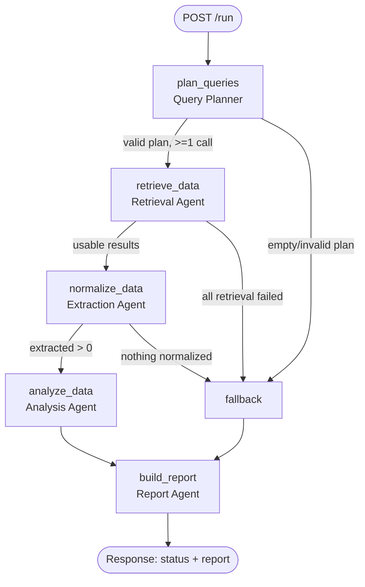

# Agentic Search Intelligence System

A production-minded **multi-agent pipeline** that answers questions about how a brand shows up in
search engines and AI answers. It is built as an explicit **LangGraph DAG** of five atomic agents
(Planner → Retrieval → Extraction → Analysis → Report), exposed through a **FastAPI JSON API** with
persistence, resilience, and observability.

Built for the _AI Agent Engineer — Technical Assessment (v2.0)_.

> **Build status:** backend complete through Phase 8 — persistence, observability, resilience, DataForSEO
> tools, LLM layer, the five atomic agents, the LangGraph DAG, and the full FastAPI service + endpoint
> layer are all implemented and verified (141 tests green; live `POST /run` returns `completed` in mock
> mode). Remaining: the dedicated Phase 9 test files, the expanded Phase 10 README, and the beyond-spec
> Phase 11 frontend. See **[`STATUS.md`](./STATUS.md)** for the live, phase-by-phase record.

---

## Table of contents

- [What it does](#what-it-does)
- [Architecture](#architecture)
- [The five agents](#the-five-agents)
- [Tech stack](#tech-stack)
- [Project structure](#project-structure)
- [Getting started](#getting-started)
- [Configuration](#configuration)
- [DataForSEO modes](#dataforseo-modes)
- [opportunity_score](#opportunity_score)
- [API overview](#api-overview)
- [Resilience & observability](#resilience--observability)
- [Testing](#testing)
- [Frontend (beyond-spec)](#frontend-beyond-spec)
- [Documentation index](#documentation-index)

---

## What it does

Given a brand profile (name, domain, industry, competitors), a pipeline run:

1. **Plans** which searches / API calls are needed to answer the question.
2. **Retrieves** raw data from DataForSEO via validated tool calls.
3. **Extracts / normalizes** messy API responses into a clean schema.
4. **Analyzes** the clean data into insights, opportunity scores, and recommendations.
5. **Reports** a final structured JSON output plus a human-readable summary.

Each step is its **own agent** with a single responsibility, wired as a directed acyclic graph with
conditional routing and a fallback path so the pipeline degrades gracefully instead of crashing.

For the full plain-English scope, read **[`WHAT_TO_BUILD.md`](./WHAT_TO_BUILD.md)**.

---

## Architecture

```
   HTTP (JSON)          ┌──────────────────────────────────────────┐
  ──────────────▶       │            FastAPI application            │
                        │   routes → services → LangGraph runner    │
                        └───────────────┬──────────────────────────┘
                                        │ invokes
                                        ▼
                        ┌──────────────────────────────────────────┐
                        │          LangGraph DAG (compiled)         │
                        │  Planner → Retrieval → Extract →          │
                        │  Analyze → Report   (+ fallback edges)    │
                        └───────────────┬──────────────────────────┘
        tools (validated)               │                observability
                 ▼                      ▼                      ▼
    ┌────────────────────┐   ┌────────────────┐   ┌────────────────────┐
    │ DataForSEO client  │   │  Persistence   │   │ logs/trace/metrics │
    │(live | mock | stub)│   │ (SQLite/SQLA)  │   │  (JSON, corr-id)   │
    └────────────────────┘   └────────────────┘   └────────────────────┘
```

### DAG flow



The full layered design, data model, and rationale live in **[`PLAN.md`](./PLAN.md)**.

---

## The five agents

Each agent does exactly one job — combining them into "do-everything" agents is explicitly avoided.

| Agent                          | Its one job                                                         |
| ------------------------------ | ------------------------------------------------------------------- |
| **Query Planner**              | Decide which searches / API calls are needed. (Never fetches.)      |
| **Search / Retrieval Agent**   | Execute planned tool calls against DataForSEO. (Never summarizes.)  |
| **Extraction / Normalization** | Turn raw API JSON into a clean schema. (Never scores.)              |
| **Analysis / Synthesis**       | Reason over clean data → insights + scores. (Never formats output.) |
| **Report Agent**               | Assemble final JSON + human summary. (Never calls tools.)           |

---

## Tech stack

| Concern          | Choice                                      |
| ---------------- | ------------------------------------------- |
| Language         | Python 3.11+                                |
| Orchestration    | LangGraph + LangChain                       |
| LLM              | OpenAI via `langchain-openai`               |
| API              | FastAPI + Uvicorn                           |
| Validation       | Pydantic v2 / pydantic-settings             |
| Persistence      | SQLAlchemy 2.0 + SQLite                     |
| HTTP client      | httpx                                       |
| Resilience       | tenacity + custom retry / circuit breaker   |
| Logging          | structlog (JSON)                            |
| Testing          | pytest + pytest-asyncio + respx             |
| Tooling          | ruff + black + mypy                         |
| Frontend (extra) | React 19 + Vite 8 + TypeScript + Tailwind 4 |

---

## Project structure

```
.
├── app/
│   ├── __main__.py            # `python -m app` entrypoint
│   ├── config.py              # Pydantic Settings (env-driven)
│   ├── api/                   # FastAPI app factory, routes, deps, error mapping
│   ├── schemas/               # Pydantic request/response models
│   ├── services/              # orchestration: run the DAG, persist, summarize
│   ├── graph/                 # LangGraph state, nodes, edges, builder
│   ├── agents/                # the 5 atomic agents
│   ├── tools/                 # tool schemas + validating wrapper + DataForSEO tools
│   ├── integrations/dataforseo/  # httpx client, endpoints, mock fixtures
│   ├── llm/                   # LLM client + prompts
│   ├── resilience/            # error taxonomy, retry/backoff, circuit breaker
│   ├── observability/         # logging, tracing, metrics
│   └── db/                    # engine/session, models, repositories
├── tests/                     # happy path, failure/retry, fallback, tool validation
├── frontend/                  # responsive dashboard (beyond-spec)
├── PLAN.md                    # detailed engineering plan
├── WHAT_TO_BUILD.md           # plain-English scope
├── STATUS.md                  # live build-status tracker
├── pyproject.toml             # deps + ruff/black/mypy/pytest config
├── Makefile                   # single-command workflows
└── .env.example               # documented configuration
```

---

## Getting started

### Prerequisites

- Python **3.11+** (developed on 3.13)
- Node **20+** and npm (only for the optional frontend)
- No API keys required — the system runs fully in DataForSEO **mock mode** by default.

### Backend

```bash
make install     # create .venv and install the package + dev dependencies
make run         # start the API at http://localhost:8000
```

Then open:

- Health probe: <http://localhost:8000/health>
- Interactive API docs: <http://localhost:8000/docs>

Equivalent without Make: `python3 -m venv .venv && .venv/bin/pip install -e ".[dev]"` then
`.venv/bin/python -m app`.

### Frontend (optional, beyond-spec)

```bash
make install-frontend    # npm install in frontend/
make run-frontend        # start Vite dev server at http://localhost:5173
```

---

## Configuration

Copy `.env.example` to `.env` and adjust as needed. Every key has a safe default, so `.env` is optional
in mock mode. Key groups:

- **LLM** — `OPENAI_API_KEY`, `LLM_MODEL`, `LLM_TEMPERATURE`
- **DataForSEO** — `DATAFORSEO_MODE` (`mock`|`live`|`stub`), `DATAFORSEO_LOGIN`, `DATAFORSEO_PASSWORD`, `DATAFORSEO_BASE_URL`
- **Timeouts & retries** — `HTTP_CONNECT_TIMEOUT_S`, `HTTP_READ_TIMEOUT_S`, `RETRY_MAX_ATTEMPTS`, `RETRY_BASE_DELAY_S`, `RETRY_MAX_DELAY_S`, `CIRCUIT_BREAKER_FAIL_THRESHOLD`, `CIRCUIT_BREAKER_COOLDOWN_S`
- **Scoring** — `OPP_WEIGHT_VOLUME`, `OPP_WEIGHT_DIFFICULTY`, `OPP_WEIGHT_GAP`, `OPP_VOLUME_CAP`
- **App** — `DATABASE_URL`, `LOG_LEVEL`, `API_HOST`, `API_PORT`, `LANGCHAIN_TRACING_V2`

Configuration is validated at startup (e.g. scoring weights must sum to `1.0`; `live` mode requires
DataForSEO credentials).

---

## DataForSEO modes

The integration supports three modes via `DATAFORSEO_MODE`:

- **`mock`** _(default)_ — deterministic local fixtures modeled on real DataForSEO response envelopes.
  No network, no credentials; tests are hermetic.
- **`live`** — calls the real DataForSEO API using Basic auth (`DATAFORSEO_LOGIN` / `DATAFORSEO_PASSWORD`).
- **`stub`** — minimal static stub responses.

One tool wraps exactly one logical API call.

---

## opportunity_score

A deterministic score in `[0, 1]` that rewards high-demand, low-difficulty keywords where the brand is
**not** currently visible:

```
volume_norm      = min(estimated_search_volume / OPP_VOLUME_CAP, 1)   # demand
difficulty_ease  = 1 - (competitive_difficulty / 100)                 # easier = better
visibility_gap   = 0.0 if domain_visible else 1.0                     # missing = opportunity

opportunity_score = round(
    OPP_WEIGHT_VOLUME * volume_norm
  + OPP_WEIGHT_DIFFICULTY * difficulty_ease
  + OPP_WEIGHT_GAP * visibility_gap, 4)
```

Weights (default `0.4 / 0.3 / 0.3`) and the volume cap are configurable and must sum to `1.0`.

---

## API overview

Base path: `/api/v1`. All responses are JSON; no authentication (out of scope).

| Method | Path                                       | Purpose                                   |
| ------ | ------------------------------------------ | ----------------------------------------- |
| POST   | `/profiles`                                | Register a brand/keyword profile          |
| GET    | `/profiles/{profile_uuid}`                 | Get a profile + summary stats             |
| POST   | `/profiles/{profile_uuid}/run`             | Run the full DAG (core endpoint)          |
| GET    | `/profiles/{profile_uuid}/queries`         | Discovered queries (filter/sort/paginate) |
| GET    | `/profiles/{profile_uuid}/recommendations` | Content recommendations                   |
| POST   | `/queries/{query_uuid}/recheck`            | Partial re-run for a single query         |

> All six endpoints are implemented and covered by contract tests (`tests/test_api.py`). The live,
> always-current contract is available at `/docs` once the server is running.

---

## Resilience & observability

- **Resilience:** retry with exponential backoff + jitter for transient failures (timeouts, 429, 5xx),
  explicit retryable vs non-retryable classification, sane per-call timeouts, a circuit breaker, and a
  fallback graph path that returns partial results with an error flag instead of crashing.
- **Observability:** structured JSON logs per node (with secret redaction), a correlation ID to trace a
  run node-by-node, and a per-run metrics summary (latency, success/failure, API call counts, tokens).

Design details and the production roadmap are in `PLAN.md` (§8–§9); a worked failure example and a
sample log/trace excerpt are added to this README in Phase 10.

---

## Testing

```bash
make test        # run the pytest suite
make lint        # ruff
make typecheck   # mypy
make check       # lint + typecheck + test
```

Tests are hermetic (mock LLM + mock DataForSEO + in-memory SQLite) and cover, at minimum, a happy-path
run, a simulated API failure that retries/falls back, and tool-call argument validation.

---

## Frontend (beyond-spec)

The assessment is backend-only; a responsive React + Vite + TypeScript + Tailwind dashboard is included
as a deliberate extra to demonstrate end-to-end product sense. It is fully decoupled and talks to the API
over HTTP, so the backend remains runnable and gradable without it. See `frontend/` and Phase 11 in
`PLAN.md`.

---

## Documentation index

| Doc                                      | Purpose                                         |
| ---------------------------------------- | ----------------------------------------------- |
| [`README.md`](./README.md)               | This file — overview, setup, architecture       |
| [`WHAT_TO_BUILD.md`](./WHAT_TO_BUILD.md) | Plain-English scope of the assessment           |
| [`PLAN.md`](./PLAN.md)                   | Detailed engineering plan + traceability matrix |
| [`STATUS.md`](./STATUS.md)               | Live build-status tracker                       |
